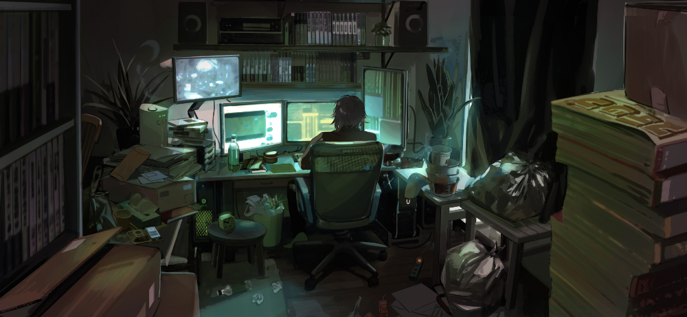

  
  <h1>Привет👋 Меня зовут Артём!</h1>
  <h3>FrontEnd разработчик</h3>

  
  
  

### 👩‍💻  Обо мне

Я начинающий Frontend разработчик. Мой путь в IT начался с игры в Minecraft благодаря моду ComputerCraft, где надо было писать код на Lua, чтобы черепашки работали на меня. Позже мне попалось видео Python за час, затем HTML, CSS и так я начал изучать программирование весной 2020 года. Верстал сайты на HTML, CSS, делал полноценные веб приложений на React + Django, создавал Android приложения на React Native, Flutter и Kotlin, писал телеграмм ботов на Python (Aiogram, Telebot, PyTelegramApi). Также создавал игры на Unity. Последний год активно увлекаюсь клиентской частью сайтов. В январе 2025 года решил выйти на фриланс и почти сразу нашел первые заказы.

### 🛠 Технологии

    
    
    
    
    
    
    
    
    
    

<!--- 
###

<h3 align="left">🔥   Моя статистика :</h3>

  
  

_
--->